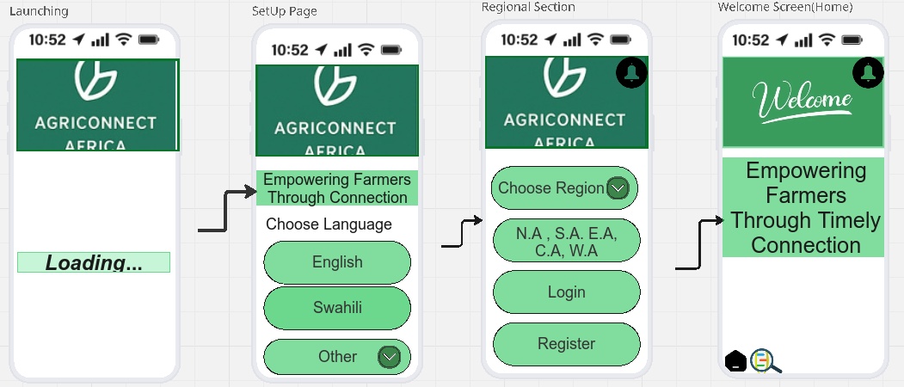
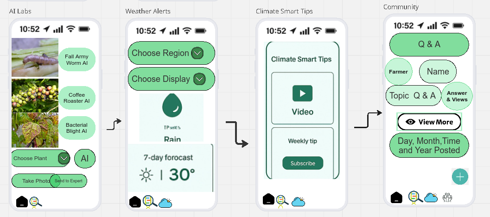
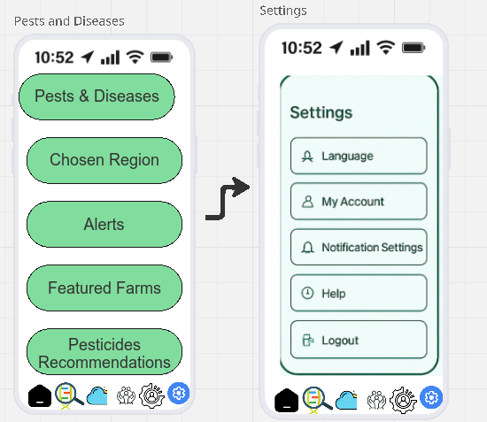

# AGRICONNECT APP WIREFRAME

## Overview

Following Tech Hive chosen Global Challenge and Opportunity, the team agreed to build an agricultural mobile application, Agriconnect Africa. The app aims to make timely and relevant agricultural information accessible to farmers in Africa, thereby improving their productivity and livelihoods. Especially in rural areas, farmers often face challenges in accessing up-to-date information on weather patterns, market prices, and best farming practices. The Agriconnect app seeks to bridge this gap by providing a user-friendly platform that delivers critical agricultural information directly to farmers' mobile devices.

Below are snapshots of the first wireframe version developed for the Agriconnect Africa app for a quick reference:

## Target Users

The primary target users for the Agriconnect app are smallholder farmers in rural Africa. These farmers often have limited access to traditional agricultural extension services and rely heavily on mobile phones for communication and information. The app is designed to cater to farmers of varying literacy levels, ensuring that even those with minimal reading skills can benefit from its features. Additionally, the app targets agricultural extension workers who can use it as a tool to disseminate information more effectively to the farming communities they serve.

## Key Features
## AI Pest and Disease Identification

This is a crucial feature of the Agriconnect app that leverages artificial intelligence to help farmers identify the type of pests or diseases affecting their crops. By simply taking a photo of the affected plant, farmers can receive instant analysis and recommendations on how to manage the issue. This feature aims to reduce crop losses and improve yields by providing timely and accurate information.

## Weather Forecasting

The weather forecasting feature provides farmers with up-to-date weather information tailored to their specific location. This includes daily and weekly forecasts, as well as alerts for extreme weather conditions such as storms or droughts. By having access to reliable weather data, farmers can make informed decisions about planting, irrigation, and harvesting, ultimately enhancing their productivity.
A subscription enables farmers to receive personalized weather updates and alerts via SMS or in-app notifications.

### Climate smart tips

This feature offers farmers practical advice on how to adapt their farming practices to changing climate conditions. It includes tips on water conservation, soil management, and crop selection that are designed to help farmers build resilience against climate-related challenges. The tips are regularly updated based on the latest research and local climate data.
Weekly tips are sent via SMS or in-app notifications to keep farmers informed and engaged.
Partnerships with local agricultural organizations ensure that the tips are relevant and culturally appropriate.

### Community Forum

The community forum feature provides a platform for farmers to connect, share experiences, and seek advice from their peers. This social aspect of the app fosters a sense of community among farmers and encourages knowledge exchange. Users can post questions, share success stories, and discuss various agricultural topics.
Moderation by agricultural experts ensures that the information shared is accurate and reliable.
The forum is organized into categories based on crop types, farming techniques, and regional issues to facilitate navigation.

### Resources

The resources section of the Agriconnect app offers a comprehensive library of educational materials, including articles, videos, and tutorials on various agricultural topics. These resources are designed to enhance farmers' knowledge and skills, enabling them to implement best practices in their farming operations.
It is made up of the following sections:

- **Crop Information**: Detailed guides on different crops, including a detailed description, procedures for planting, pest management, and harvesting, uses and market information.
- **Farm Management**: Articles and tutorials on effective farm management practices, including soil health, irrigation techniques, and financial planning.
- **Video Library**: A collection of instructional videos covering a wide range of agricultural topics, from planting techniques to post-harvest handling.
- **Expert Interviews**: Recorded interviews with agricultural experts and successful farmers sharing insights and advice.
- **Pests and Diseases**: A dedicated section providing information on common pests and diseases, including identification guides and management strategies.

All these features are designed to empower farmers with the knowledge and tools they need to improve their agricultural practices and livelihoods.
The resources are regularly updated to ensure that farmers have access to the latest information and research in the field of agriculture.
USSD enables farmers without smartphones to access key resources via simple text commands.
